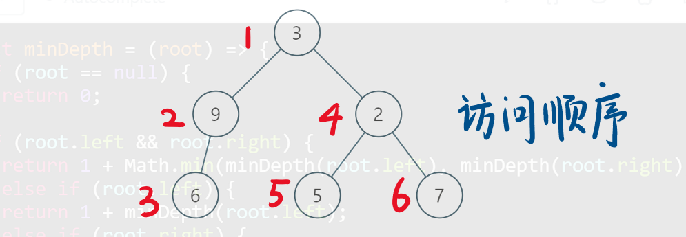
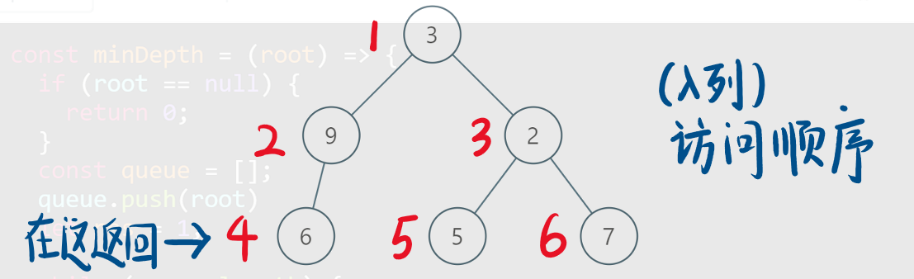
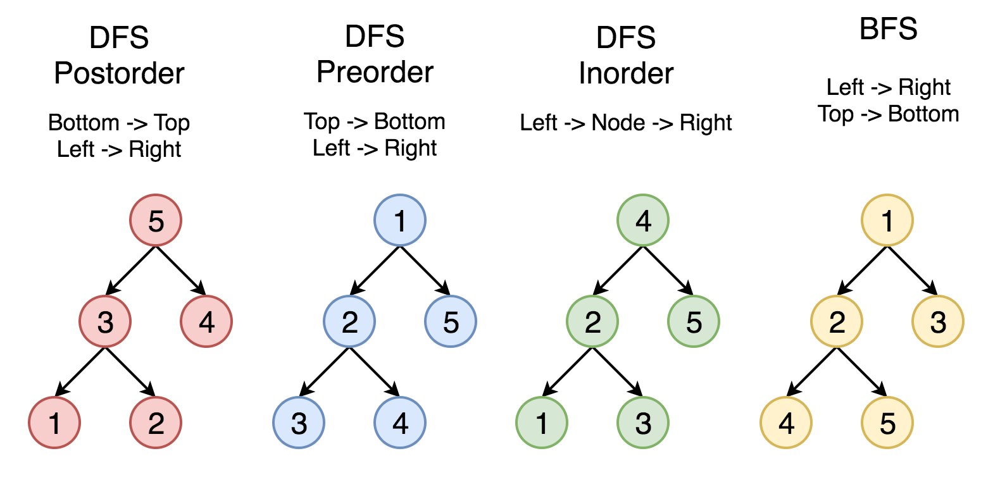

### 1. 问题解答篇：

#### 1.1 关于 HashMap 的小总结

这个目前对java不是很熟，后续补上，先placeholder, `_`(python中的占位符)

#### 2.1 树的面试题解法一般都是递归，为什么？

因为树的结构是非线性的，也不是环，也就是说树的各个节点单独来看都是一颗树：左子树，右子树，父节点，也就是最小的重复单元，递归三要素：1. 终止条件，2.返回值，3.最小重复单元(也就是每个重复单元干的事情) 中非常关键的一点就是重复性。树的结构决定了它满足这种重复性，所以树的面试题目一般都是递归。

### 2. 相关数据结构以及算法

#### 2.1 hash table

* 相关题目：

  两数之和

  有效的字母异位词

  字母异位词分组（有很大的技巧性）

  代码很传神，niubility！可以赏析一下：

  ````python
  def groupAnagrams(self, strs: List[str]) -> List[List[str]]:
          # 分类计数方法: 很奇妙
          # https://leetcode-cn.com/problems/group-anagrams/solution/zi-mu-yi-wei-ci-fen-zu-by-leetcode/
          import collections
          ans = collections.defaultdict(list)
          for s in strs:
              count = [0 for _ in range(26)]
              for c in s:
                  count[ord(c) - ord('a')] += 1
              ans[tuple(count)].append(s)
              print(tuple(count))
          return list(ans.values())
          # 排序方法：
          # ans = collections.defaultdict(list)
          # for s in strs:
          #     ans[tuple(sorted(s))].append(s)
              
          # return list(ans.values())
  ````

  

#### 2.2 tree

树的实例代码，要滚瓜烂熟。

树的代码写起来都是套路，就像古代举子们参加科举考试，按照要求来作答。

Linked List是特殊化的 Tree（线性树），Tree是特殊化的 Graph(没有环)。

```python
# python code
class TreeNode:
    def __init__(self, val):
        self.val = val
        self.left = None
        self.right = None
```

```c++
struct TreeNode{
    int val;
    TreeNode * left;
    TreeeNode * right;
    // construct function
    TreeNode(int x): val(x), left(NULL), right(NULL) {}
}
`
```

```java
//java code
public class TreeNode{
    public int val;
    public TreeNode left, right;
    public TreeNode(int val){
        this.val = val;
        this.left = null;
        this.right = null;
    }
}
```

二叉树遍历 Pre order/In order/Post order (关键术语的英文名称一定要懂，否则面试的时候可能蒙圈)

1. 前序(pre order) 根-左-右

2. 中序(in order) 左-根-右

3. 后序(post order) 左-右-根

   注意：上述三种情况 都是先左后右的相对顺序。

```python
# 实例代码:
def preorder(self, root):
    if root:
        self.traverse_path.append(root.val)
        self.preorder(root.left)
        self.preorder(root.right)
def inorder(self, root):
    if root:
        self.inorder(root.left)
        self.traverse_path.append(root.val)
        self.inorder(root.right)
def preorder(self,root):
    if root:
        self.preorder(root.left)
        self.preorder(root.right)
        self.traverse_path.append(root.val)
```

* 树的深度优先(DFS)和广度优先(BFS)

  DFS: 在这个策略中，我们采用`深度`作为优先级，以便从跟开始一直到达某个确定的叶子，然后再返回根到达另一个分支。

  深度优先示意图:

  

  深度优先搜索策略又可以根据根节点、左孩子和右孩子的相对顺序被细分为`前序遍历`，`中序遍历`和`后序遍历`。

  BFS: 我们按照高度顺序一层一层的访问整棵树，高层次的节点将会比低层次的节点先被访问到。

  BFS示意图：

  

  下图中的顶点按照访问的顺序编号，按照 `1-2-3-4-5` 的顺序来比较不同的策略。

  

* 二叉搜索树
  也称二叉 排序 树 、有序二叉树（ Ordered Binary Tree ）、 排序二叉树（ Sorted Binary Tree 是指一棵空树或者具有下列性质的二叉树

  1. 左子树上 所有结点 的值均小于它的根结点的值
  2. 右子树上 所有结点 的值均大于它的根结点的值
  3. 以此类推：左、右子树也分别为二叉查找树 。 这就是 重复性
  中序遍历：升序排列

* 二叉树的遍历的迭代模板(伪代码)：

  参考链接：https://leetcode-cn.com/problems/binary-tree-preorder-traversal/solution/tu-jie-er-cha-shu-de-si-chong-bian-li-by-z1m/

  ````python
  边界条件
  
  初始化 cur, stack, root
  while stack or cur != None:
      while 循环:
          cur 向左下或右下遍历
      弹出节点 tmp
      cur 回到 tmp 的左或右子树
  返回结果
  ````

  代码实现见链接：

  https://shimo.im/docs/D68KxVpHjWGdJXk3

* 树的题目：

  ​	二叉树的中序遍历

  ​	二叉树的前序遍历

  ​	二叉树的后续遍历

  ​	二叉树的最大深度

  ​	二叉树的最小深度

  ​	二叉树的层序遍历

  ​	n叉树的前序遍历

  ​	n叉树的后续遍历

  ​	n叉树的层序遍历

  ​	n叉树的最大深度


#### 2.3 heap 堆

heap 是一种数据结构具有以下的特点：

1. 完全二叉树
2. heap中存储的值是`偏序`

* Min-heap: 小根堆（小顶堆）父节点的值小于或等于子节点的值；

* Max-heap: 大根堆（大顶堆）父节点的值大于或等于子节点的值；

* 堆的存储：

  一般都是用数组来表示堆，`i`节点的父节点下标就为`(i - 1)/2`。 它的左右子节点下标分别为`2 * i +1` 和`2 * i + 2` 如第0个节点的左右子节点下标分别为1和2.

* 堆的操作： (各种操作方法的函数要牢记会写)

  buildheap (构建堆,堆化数组), 

  insert

  removemax(max-heap)

  removemin(min-heap)

  heapsort

* 堆的题目：

  前-k-个高频元素

  前-k-个最小的数

  第-k-个最大值

  滑动窗口最大值

* 关于堆的一个不错的代码(python版本):

  ````python
  class HeapList():
      """
      大顶堆
      """
      def __init__(self):
          self.heaplist = [0]
          self.size = 0
  
      def buildHeap(self, alist):
           i = len(alist) // 2
           self.size = len(alist)
           self.heaplist += alist[:]
           while i > 0:
               self.percDown(i)
               i -= 1
  
      def delMax(self):
          """删除堆顶最大元素"""
          retval = self.heaplist[1]
          self.heaplist[1] = self.heaplist[self.size]
          self.size -= 1
          self.heaplist.pop()
          self.percDown(1)
          return retval
  
      def insert(self, k):
          self.heaplist.append(k)
          self.size += 1
          self.percUP(self.size)
  
      def percUP(self, i):
          while i // 2 > 0:
              if self.heaplist[i] > self.heaplist[i // 2]:
                  self.heaplist[i], self.heaplist[i // 2] = self.heaplist[i // 2], self.heaplist[i]
              i //= 2
  
      def percDown(self, i):
          while i * 2 <= self.size:
              mc = self.maxChild(i)
              if self.heaplist[i] < self.heaplist[mc]:
                  self.heaplist[i], self.heaplist[mc] = self.heaplist[mc], self.heaplist[i]
              i = mc
  
      def maxChild(self, i):
          if 2 * i + 1 > self.size:
              return 2 * i
          else:
              if self.heaplist[2 * i] > self.heaplist[2 * i + 1]:
                  return 2 * i
              else:
                  return 2 * i + 1
  ````

  java的代码：https://shimo.im/docs/WD7Py63bsZMyEeHL

  ###  3. 数学技巧性总结

  #### 1. 三步问题：

  三步问题其实就是斐波那契数列的推广，就是每一个数等于它前面3个数的和。

  这个问题的巧妙在于运用了中国余数定理，当然了不会余数定理没关系（反正我也忘记了）也可以简单推出这个题目的技巧。

     f(n) = f(n-1) + f(n-2) + f(n-3)

   要考察动态规划，主要是考察为什么可以在过程中取模而不影响最终结果，（python）只在最终return的结果上取模就超时了

  ​    状态转移方程不用说了：S(n) = S(n-1)+S(n-2)+S(n-3)

  ​    因为要对结果S(n)取模，用S(n)'代S(n)取模的结果，即 if S(n) > 1000000007: S(n)'= S(n) - n1000000007

  ​    于是如果对S(n+1)取模有：S(n+1) = S(n) + S(n-1) + S(n-2) = S(n)' + n1000000007 + S(n-1) + S(n-2)

  ​    S(n+1) % 1000000007 = ( S(n)' + S(n-1) + S(n-2) ) % 1000000007

  ​    所以即使在中间取模也不影响结果

  ​    https://leetcode-cn.com/problems/three-steps-problem-lcci/solution/san-bu-wen-ti-zhong-jian-guo-cheng-zhong-qu-mo-er-/

  ````python
  def waysToStep(self, n: int) -> int:
          # f(n) = f(n-1) + f(n-2) + f(n-3)
          f = [1,2,4]
          if n <4:
              return f[n-1]
          f1, f2, f3, f4 = 1, 2, 4, 0
          # 非常重要的思想：中间结果取模不影响最终结果
          for i in range(4,n+1):
              f4 = (f1 + f2 + f3) % 1000000007
              f1 = f2
              f2 = f3
              f3 = f4
          return f4
  ````

  

  #### 2. 阶乘尾数的问题

  ````
  def trailingZeroes(self, n):
          """
          :type n: int
          :rtype: int
          """
          # 思路:其实n!中的零全部是5和2的倍数贡献的，由于因子为2的个数大于5的，
          # 所以，只需计算其中有多少个5的倍数即可。
          if n == 0:
              return 0
          m5 = 0
          while n > 0:
              n = n // 5
              m5 += n
          return m5
  ````

  #### 3. 矩阵快速幂

  矩阵快速幂的题目，很多都是针对类似斐波那契数列这类题目，感觉写起来非常繁琐。一定要放链接，放链接，放链接，重要的说三遍，因为一不小心过段时间你就找不到了。（深刻教训！捂脸。）

  这里给个链接，有空了再好好研究。

  https://www.cnblogs.com/MMMMMMMW/p/12300262.html

  https://leetcode-cn.com/problems/climbing-stairs/solution/pa-lou-ti-by-leetcode-solution/

  https://leetcode-cn.com/problems/climbing-stairs/solution/pa-lou-ti-de-olognzui-qiang-suan-fa-ju-zhen-kuai-s/

  #### 4. 丑数

  这个的确代码很巧妙，值得学习。

  ````python
  class Solution:
      def isUgly(self, num: int) -> bool:
      	# 丑数就是只包含质因数 2, 3, 5 的正整数。
          if num == 1:
              return True
          if num < 1:
              return False
          while num % 2 ==0: num/=2
          while num % 3 ==0:num/=3
          while num % 5 == 0:num/=5
          
          return num == 1
  ````
  
  
  
  ### 4. 补充一下图
  
  手敲一遍也有个大概印象
  
  ````python
  visited = set() # 和树中的DFS最大区别,因为有环（可能重复访问）
  def dfs(node, visited):
  	if node in visited:
        # already visited, so terminator
          return 
    visited.add(node)
      # process current node here.
    for next_node in node.children():
          if not next_node in visited:
            dfs(next_node, visited)
              
  def BFS(graph, start, end):
      queue = []
      queue.append([start])
      visited = set() 
      while queue:
          node = queue.pop()
          visited.add(node)
          process(node)
          nodes = generate_related_nodes(node)
          queue.push(nodes)
  def generate_related_nodes(node):
      pass
  ````
  
  
  
  #### 5. 莫里斯遍历
  
  这个是二叉树遍历的一种简便方法，没看懂。
  
  给出链接吧，后续有空了去专门学习下。
  
  莫里斯遍历：https://www.sciencedirect.com/science/article/abs/pii/0020019079900681
  
  论文标题：Traversing binary trees simply and cheaply
  
  https://leetcode-cn.com/problems/binary-tree-preorder-traversal/solution/er-cha-shu-de-qian-xu-bian-li-by-leetcode/
  
  

### reference

* 数据结构的可视化：https://visualgo.net/zh/bst?slide=1

* 堆、大根堆、小跟堆：https://www.cnblogs.com/wangchaowei/p/8288216.html

* 堆排序：https://www.geeksforgeeks.org/heap-sort/

- 连通图个数：[ https://leetcode-cn.com/problems/number-of-islands/](https://leetcode-cn.com/problems/number-of-islands/)
- 拓扑排序（Topological Sorting）：[ https://zhuanlan.zhihu.com/p/34871092](https://zhuanlan.zhihu.com/p/34871092)
- 拓扑排序（leetcode）https://leetcode-cn.com/problems/course-schedule-ii/description/
- https://leetcode-cn.com/problems/sequence-reconstruction/
- https://leetcode-cn.com/problems/alien-dictionary/
- https://www.geeksforgeeks.org/given-sorted-dictionary-find-precedence-characters/
- 最短路径（Shortest Path）：Dijkstra https://www.bilibili.com/video/av25829980?from=search&seid=13391343514095937158
- 最小生成树（Minimum Spanning Tree）：[ https://www.bilibili.com/video/av84820276?from=search&seid=17476598104352152051](https://www.bilibili.com/video/av84820276?from=search&seid=17476598104352152051)


