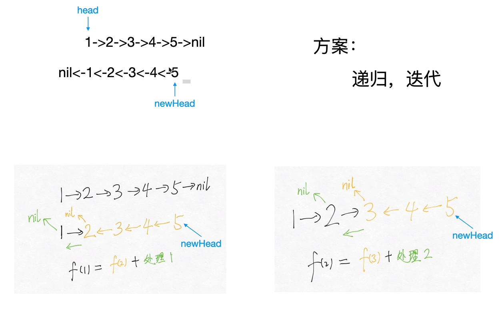
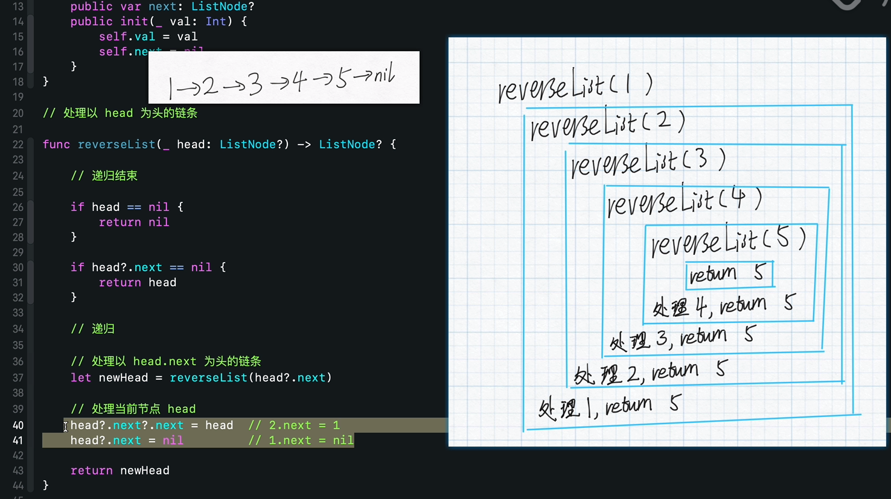
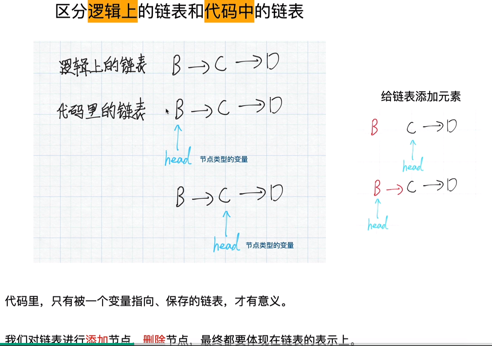
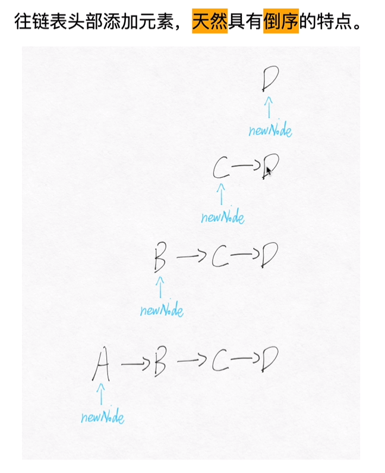
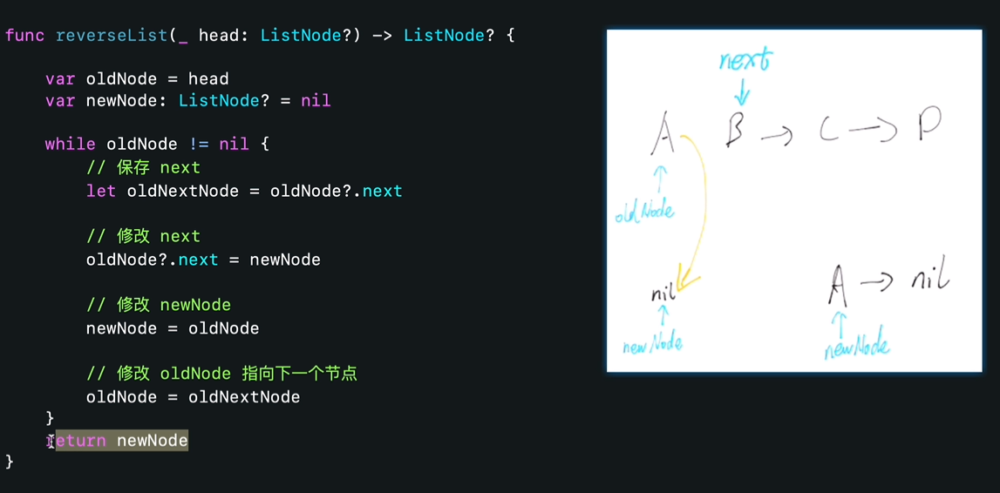

## 广义递归、分治、回溯

### 1. 递归

  #### 1. 递归的思想：

递归：通过函数体来进行的循环。递归三要素：终止条件，单次的过程（最小重复单元），返回值。

单次的过程：因为递归是重复做一样的事情，所以从宏观上考虑，只用考虑某一步是怎么完成的就可以了。

递归的模板：

````python
def recursion(level, param1, param2, ...):
    # recursion terminator
    if level > MAX_LEVEL:
        # process_result
        return
    
    # process logic in current level
    process(level data...)
    
    # drill down
    self.recursion(level + 1, p1, ...)
    
    # reverse the current level status if needed
    
    
````

* 思维要点：
  1. 不要人肉进行递归（最大误区）
  2. 找到最近最简方法，将其拆解成可重复解决的问题（重复子问题）
  3. 数学归纳法

​	递归本质上就是一个栈，先进后出。先入栈（递推到底），再出栈（一路回归）。

​	特别值得注意的是：只要递归没有达到终止条件，递归一直处于入栈，也就是递推到底的状态中，是没有返回值的，这一点要牢记。

​	当搞不清楚的时候，不妨向下图一样画出来这样的一个重复子单元的过程。

​	最经典的题目是链表的逆序（反转链表）链表反向打印等。

参考链接：https://leetcode-cn.com/problems/reverse-linked-list/solution/shi-pin-jiang-jie-di-gui-by-geek-8m/

​	链表反转示意图：

​	



下面给出代码可以和上图比较一下，结合起来比较好理解：

针对链表的递归，非常经典。

````python
class Solution:
    def reverseList(self, head: ListNode) -> ListNode:
        if not head or not head.next:
            return head
        ret = self.reverseList(head.next)
        # 原来1->2-...., 现在反转到2->1.
        # 当前节点的下一个节点的next 指向当前节点
        head.next.next = head
        # 将1指向空
        head.next = None
        return ret
````

与迭代法的比较:









#### 2. 记忆化递归：

记忆化递归的思想就是以空间换取时间，将历史求解问题记录下来。

为什么要记忆化递归？

​		因为普通的递归可能会重复求解某一值，类似斐波那契数列。同样的子问题可能会被求解多次，这样就会很慢很慢很慢。（只要想想一下，递归的求解过程是一个树形结构，就不难理解）

解决方法：我们**把历史求解（子问题）记录下来**，如果下次需要求解子问题，那么直接取出就好。其时间复杂度为O（1）。

一个记忆化递归的例子：

````python
# 开辟一个新数组来存储历史结果。
m = [0 for _ in range(max_size)]
def f(n):
    if n <= 1:
        return n
    if not m[n]:
        m[n] = f(n - 1) + f(n - 2)
    return m[n]
````

#### 3. 尾递归

尾递归是指，在函数返回的时候，调用函数本身，并且return语句不能包含表达式。这样，编译器或者解释器就可以把尾递归做优化，使递归本身无论调用多少次，都只占用一个栈帧，不会出现栈溢出的情况。 尾递归调用时，如果做了优化，栈不会增长，因此，无论多少次调用也不会导致栈溢出。

对递归的优化手段一般就是采用尾递归+缓存。

````python
# 尾递归的例子，爬楼梯问题
from functools import lru_cache
class Solution:
    def climbStairs(self, n: int) -> int:
        # f(n) = f(n -1) + f(n-2)
        f0, f1 = 0, 1
        
        # for _ in range(n):
        #     f0, f1 = f1, f0 + f1
        # return f1
        # 尾递归
        return self.helper(n, f0, f1)
    @lru_cache
    def helper(self, n, f0, f1):
        if n < 0:
            return f0
        return self.helper(n - 1, f1, f0+f1)
````

### 2. 回溯

回溯法 采用试错的思想，它尝试分步的去解决一个问题。在分步解决问题的过程中，当它通过尝试发现现有的分步答案不能得到有效的正确的解答的时候，它将取消上一步甚至是上几步的计算，再通过其它的可能的分步解答再次尝试寻找问题的答案。回溯法通常用最简单的递归方法来实现，在反复重复上述的步骤后可能出现两种情况：

* 找到一个可能存在的正确的答案；
* 在尝试了所有可能的分步方法后宣告该问题没有答案。

​        深度优先搜索 算法（英语：Depth-First-Search，DFS）是一种用于遍历或搜索树或图的算法。这个算法会 尽可能深 的搜索树的分支。当结点 v 的所在边都己被探寻过，搜索将 回溯 到发现结点 v 的那条边的起始结点。这一过程一直进行到已发现从源结点可达的所有结点为止。如果还存在未被发现的结点，则选择其中一个作为源结点并重复以上过程，整个进程反复进行直到所有结点都被访问为止。


该部分内容部分参照自下面链接:


解决一个回溯问题，实际上就是一个决策树的遍历过程。你只需要思考 3 个问题：

1、路径：也就是已经做出的选择。

2、选择列表：也就是你当前可以做的选择。

3、结束条件：也就是到达决策树底层，无法再做选择的条件。

回溯算法的框架的伪代码：

````python
result = []
def backtrack(路径, 选择列表):
    if 满足结束条件:
        result.add(路径)
        return
    
    for 选择 in 选择列表:
        做选择
        backtrack(路径, 选择列表)
        撤销选择
````

**其核心就是 for 循环里面的递归，在递归调用之前「做选择」，在递归调用之后「撤销选择」**，特别简单。

````Python
def backtrack(路径，选择列表):
    for 选择 in 选择列表:
        # 做选择
        将该选择从选择列表移除
        路径.add(选择)
        backtrack(路径, 选择列表)
        # 撤销选择
        路径.remove(选择)
        将该选择再加入选择列表
````

**我们只要在递归之前做出选择，在递归之后撤销刚才的选择**，就能正确得到每个节点的选择列表和路径。

#### 从全排列问题开始理解回溯算法

我们尝试在纸上写 3 个数字、4 个数字、5 个数字的全排列，相信不难找到这样的方法。以数组 [1, 2, 3] 的全排列为例。

先写以 1 开头的全排列，它们是：[1, 2, 3], [1, 3, 2]，即 1 + [2, 3] 的全排列（注意：递归结构体现在这里）；
再写以 2 开头的全排列，它们是：[2, 1, 3], [2, 3, 1]，即 2 + [1, 3] 的全排列；
最后写以 3 开头的全排列，它们是：[3, 1, 2], [3, 2, 1]，即 3 + [1, 2] 的全排列。


说明：

* 每一个结点表示了求解全排列问题的不同的阶段，这些阶段通过变量的「不同的值」体现，这些变量的不同的值，称之为「状态」；
* 使用深度优先遍历有「回头」的过程，在「回头」以后， 状态变量需要设置成为和先前一样 ，因此在回到上一层结点的过程中，需要撤销上一次的选择，这个操作称之为「状态重置」；
* 深度优先遍历，借助系统栈空间，保存所需要的状态变量，在编码中只需要注意遍历到相应的结点的时候，状态变量的值是正确的，具体的做法是：往下走一层的时候，path 变量在尾部追加，而往回走的时候，需要撤销上一次的选择，也是在尾部操作，因此 path 变量是一个栈；
* 深度优先遍历通过「回溯」操作，实现了全局使用一份状态变量的效果。
  使用编程的方法得到全排列，就是在这样的一个树形结构中完成 遍历，从树的根结点到叶子结点形成的路径就是其中一个全排列

#### 设计状态变量

* 首先这棵树除了根结点和叶子结点以外，每一个结点做的事情其实是一样的，即：在已经选择了一些数的前提下，在剩下的还没有选择的数中，依次选择一个数，这显然是一个 递归 结构；
* 递归的终止条件是： 一个排列中的数字已经选够了 ，因此我们需要一个变量来表示当前程序递归到第几层，我们把这个变量叫做 depth，或者命名为 index ，表示当前要确定的是某个全排列中下标为 index 的那个数是多少；
* 布尔数组 used，初始化的时候都为 false 表示这些数还没有被选择，当我们选定一个数的时候，就将这个数组的相应位置设置为 true ，这样在考虑下一个位置的时候，就能够以 O(1)O(1) 的时间复杂度判断这个数是否被选择过，这是一种「以空间换时间」的思想。
  这些变量称为「状态变量」，它们表示了在求解一个问题的时候所处的阶段。需要根据问题的场景设计合适的状态变量。

````python
from typing import List

class Solution:
    def permute(self, nums: List[int]) -> List[List[int]]:
        def dfs(nums, size, depth, path, used, res):
            if depth == size:
                # 变量 path 所指向的列表 在深度优先遍历的过程中只有一份 ，
                # 深度优先遍历完成以后，回到了根结点，成为空列表。因此要用path[:]做一个浅拷贝
                res.append(path[:])
                return

            for i in range(size):
                if not used[i]:
                    used[i] = True
                    path.append(nums[i])

                    dfs(nums, size, depth + 1, path, used, res)

                    used[i] = False
                    path.pop()

        size = len(nums)
        if len(nums) == 0:
            return []

        used = [False for _ in range(size)]
        res = []
        dfs(nums, size, 0, [], used, res)
        return res


if __name__ == '__main__':
    nums = [1, 2, 3]
    solution = Solution()
    res = solution.permute(nums)
    print(res)
````

##### 理解回溯

从 [1, 2, 3] 到 [1, 3, 2] ，深度优先遍历是这样做的，从 [1, 2, 3] 回到 [1, 2] 的时候，需要撤销刚刚已经选择的数 3，因为在这一层只有一个数 3 我们已经尝试过了，因此程序回到上一层，需要撤销对 2 的选择，好让后面的程序知道，选择 3 了以后还能够选择 2。

执行深度优先遍历，从较深层的结点返回到较浅层结点的时候，需要做「状态重置」，即「回到过去」、「恢复现场」。

下面通过打印输出结果观察：

````
  递归之前 => [1]
  递归之前 => [1, 2]
  递归之前 => [1, 2, 3]
递归之后 => [1, 2]
递归之后 => [1]
  递归之前 => [1, 3]
  递归之前 => [1, 3, 2]
递归之后 => [1, 3]
递归之后 => [1]
递归之后 => []
  递归之前 => [2]
  递归之前 => [2, 1]
  递归之前 => [2, 1, 3]
递归之后 => [2, 1]
递归之后 => [2]
  递归之前 => [2, 3]
  递归之前 => [2, 3, 1]
递归之后 => [2, 3]
递归之后 => [2]
递归之后 => []
  递归之前 => [3]
  递归之前 => [3, 1]
  递归之前 => [3, 1, 2]
递归之后 => [3, 1]
递归之后 => [3]
  递归之前 => [3, 2]
  递归之前 => [3, 2, 1]
递归之后 => [3, 2]
递归之后 => [3]
递归之后 => []
输出 => [[1, 2, 3], [1, 3, 2], [2, 1, 3], [2, 3, 1], [3, 1, 2], [3, 2, 1]]
````

#### 剪枝

* 回溯算法会应用「剪枝」技巧达到以加快搜索速度。有些时候，需要做一些预处理工作（例如排序）才能达到剪枝的目的。预处理工作虽然也消耗时间，但能够剪枝节约的时间更多；
  提示：剪枝是一种技巧，通常需要根据不同问题场景采用不同的剪枝策略，需要在做题的过程中不断总结。

* 由于回溯问题本身时间复杂度就很高，所以能用空间换时间就尽量使用空间。


剪枝也通过一个例子来说明，参考leetcode 77 组合的题目(https://leetcode-cn.com/problems/combinations/solution/hui-su-suan-fa-jian-zhi-python-dai-ma-java-dai-ma-/)

#### 根据搜索起点画出二叉树

既然是树形问题上的 深度优先遍历，因此首先画出树形结构。例如输入：n = 4, k = 2，我们可以发现如下递归结构：

1. 如果组合里有 1 ，那么需要在 [2, 3, 4] 里再找 11 个数；
2. 如果组合里有 2 ，那么需要在 [3, 4] 里再找 11数。注意：这里不能再考虑 1，因为包含 1 的组合，在第 1 种情况中已经包含。

依次类推（后面部分省略），以上描述体现的 递归 结构是：在以 nn 结尾的候选数组里，选出若干个元素。画出递归结构如下图：


说明：

* 叶子结点的信息体现在从根结点到叶子结点的路径上，因此需要一个表示路径的变量 path，它是一个列表，特别地，path 是一个栈；
* 每一个结点递归地在做同样的事情，区别在于搜索起点，因此需要一个变量 start ，表示在区间 [begin, n] 里选出若干个数的组合；
* 可能有一些分支没有必要执行，这就用到了我们提到的`剪枝`

> 友情提示：对于这一类问题，画图帮助分析是非常重要的解题方法。

####  优化：分析搜索起点的上界进行剪枝

事实上，如果 n = 7, k = 4，从 55 开始搜索就已经没有意义了，这是因为：即使把 55 选上，后面的数只有 66 和 77，一共就 33 个候选数，凑不出 44 个数的组合。因此，搜索起点有上界，这个上界是多少，可以举几个例子分析。

分析搜索起点的上界，其实是在深度优先遍历的过程中剪枝，剪枝可以避免不必要的遍历，剪枝剪得好，可以大幅度节约算法的执行时间。

下面的图片绿色部分是剪掉的枝叶，当 n 很大的时候，能少遍历很多结点，节约了时间。


容易知道：搜索起点和当前还需要选几个数有关，而当前还需要选几个数与已经选了几个数有关，即与 path 的长度相关。我们举几个例子分析：

例如：n = 6 ，k = 4。

> len(path) == 1 的时候，接下来要选择 33个数，搜索起点最大是 4，最后一个被选的组合是 [4, 5, 6]；
> len(path) == 2 的时候，接下来要选择 2 个数，搜索起点最大是 5，最后一个被选的组合是 [5, 6]；
> len(path) == 3 的时候，接下来要选择 1 个数，搜索起点最大是 6，最后一个被选的组合是 [6]；

再如：n = 15 ，k = 4。

> len(path) == 1 的时候，接下来要选择 3 个数，搜索起点最大是 13，最后一个被选的是 [13, 14, 15]；
> len(path) == 2 的时候，接下来要选择 2 个数，搜索起点最大是 14，最后一个被选的是 [14, 15]；
> len(path) == 3 的时候，接下来要选择 1 个数，搜索起点最大是 15，最后一个被选的是 [15]；

可以归纳出：

> 搜索起点的上界 + 接下来要选择的元素个数 - 1 = n
> 其中，接下来要选择的元素个数 = k - len(path)，整理得到：

> 搜索起点的上界 = n - (k - len(path)) + 1
> 所以，我们的剪枝过程就是：把 i <= n 改成 i <= n - (k - len(path)) + 1 ：

````python
class Solution:
    def combine(self, n: int, k: int) -> List[List[int]]:
        # 通过本题目，下次有多重方法时直接通过函数内部的不同函数名来区分，不要注释掉了，否则后面提交到github上看不清晰。
        # 方法一：没有剪枝操作
        def dfs(n, k, begin, path,  res):
            # 终止递归的条件是:path 的长度等于k
            if len(path) == k:
                res.append(path[:])
                return
            
            # 遍历可能的搜索起点
            for i in range(begin, n+1):
                # 向路径中添加一个数
                path.append(i)
                # 下一轮搜索，设置的搜索起点要加1，因为组合数不允许出现重复元素。
                # print(" recursion before => " ,path)
                dfs(n, k, i + 1, path, res)
                # print(" recursion after => " , path)
                # 重点理解这里：深度优先遍历有回头的过程：因为递归之前做什么，递归之后做相同的操作。
                path.pop()
        
        # 方法2：backtrack + pruning  回溯 + 剪枝
        def dfs_pruning(n,k, begin, path, res):
            if len(path) == k:
                res.append(path[:])
                return
            # 我们的剪枝过程就是：把 i <= n 改成 i <= n - (k - path.size()) + 1 
            for i in range(begin, n - (k - len(path)) + 1 + 1):
                path+=i
                dfs_pruning(n, k, i + 1, path, res)
                path.pop()
        res = []
        if k <= 0 or n < k or k <=0 :
            return []
        # 从1开始是题目设定的要求
        path = []
        # 方法一
        # dfs(n, k, 1, path, res)
        # 方法二
        # dfs_pruning(n, k, 1, path, res)
        import itertools
        # 其实这个地方可以去看itertools.combinations的实现，因为这个实现在所有提交结果中效率是最高的。
        res = list(itertools.combinations(range(1,n+1),k))
        # 个人猜想是c/c++实现的，然后编译成python的接口。

        return res
````


#### 总结

*做题的时候，建议 先画树形图 ，画图能帮助我们想清楚递归结构，想清楚如何剪枝。拿题目中的示例，想一想人是怎么做的，一般这样下来，这棵递归树都不难画出。*

在画图的过程中思考清楚：

* 分支如何产生；
* 题目需要的解在哪里？是在叶子结点、还是在非叶子结点、还是在从跟结点到叶子结点的路径？
* 哪些搜索会产生不需要的解的？例如：产生重复是什么原因，如果在浅层就知道这个分支不能产生需要的结果，应该提前剪枝，剪枝的条件是什么，代码怎么写？

### 3. 数学技巧

#### 1. 摩尔投票法（Boyer-Moore）

Boyer-Moore Majority Vote 摩尔多数投票法，在wipipedia 的介绍：https://en.wikipedia.org/wiki/Boyer%E2%80%93Moore_majority_vote_algorithm

本周的练习题目中，leetcode 169 多数元素的题目中出现了以摩尔投票法来进行解决问题的思路。

摩尔投票法的思想：

如果我们把众数记为 +1+1，把其他数记为 -1−1，将它们全部加起来，显然和大于 `0`，从结果本身我们可以看出众数比其他数多。

Boyer-Moore 算法的详细步骤： 

*我们维护一个候选众数 candidate 和它出现的次数 count。初始时 candidate 可以为任意值，count 为 0；*

*我们遍历数组 nums 中的所有元素，对于每个元素 x，在判断 x 之前，如果 count 的值为 0，我们先将 x 的值赋予 candidate，随后我们判断 x：*

​	*> 如果 x 与 candidate 相等，那么计数器 count 的值增加 1；*

​	*> 如果 x 与 candidate 不等，那么计数器 count 的值减少 1。*

*在遍历完成后，candidate 即为整个数组的众数。*

https://leetcode-cn.com/problems/majority-element/solution/duo-shu-yuan-su-by-leetcode-solution/

````python
class Solution:
    def majorityElement(self, nums):
        count = 0
        candidate = None

        for num in nums:
            if count == 0:
                candidate = num
            count += (1 if num == candidate else -1)

        return candidate
````


### Reference

记忆化递归：https://zhuanlan.zhihu.com/p/73579773

递归：https://mp.weixin.qq.com/s/PgSSYc50ajnbh8zD6Ei07g

- [牛顿迭代法原理](http://www.matrix67.com/blog/archives/361)
- [牛顿迭代法代码](http://www.voidcn.com/article/p-eudisdmk-zm.html)

回朔法1：https://leetcode-cn.com/problems/permutations/solution/hui-su-suan-fa-python-dai-ma-java-dai-ma-by-liweiw/

回朔法2：https://leetcode-cn.com/problems/n-queens/solution/hui-su-suan-fa-xiang-jie-by-labuladong/

https://www.globalsoftwaresupport.com/backtracking-algorithms-explained/

https://evantamle.wordpress.com/2019/05/25/how-to-apply-pruning-technique-and-heuristic-in-backtracking-algorithms/

一个神奇而厉害的女博士的算法路：https://happygirlzt.com/codelist.html


