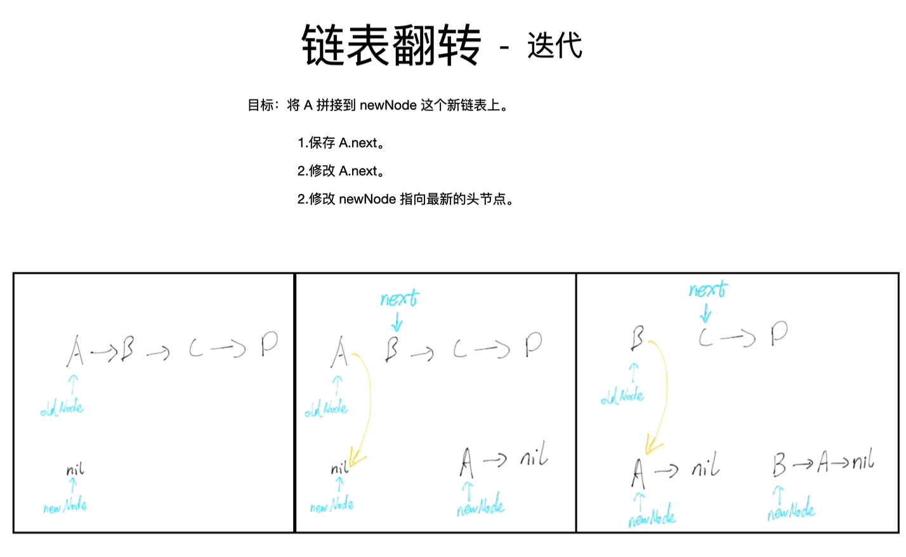

## 学习笔记

### 1. 递归

  #### 1. 递归的思想：

递归：通过函数体来进行的循环。递归三要素：终止条件，单次的过程（最小重复单元），返回值。

单次的过程：因为递归是重复做一样的事情，所以从宏观上考虑，只用考虑某一步是怎么完成的就可以了。

递归的模板：

````python
def recursion(level, param1, param2, ...):
    # recursion terminator
    if level > MAX_LEVEL:
        # process_result
        return
    
    # process logic in current level
    process(level data...)
    
    # drill down
    self.recursion(level + 1, p1, ...)
    
    # reverse the current level status if needed
    
    
````

* 思维要点：
  1. 不要人肉进行递归（最大误区）
  2. 找到最近最简方法，将其拆解成可重复解决的问题（重复子问题）
  3. 数学归纳法

​	递归本质上就是一个栈，先进后出。先入栈（递推到底），再出栈（一路回归）。

​	特别值得注意的是：只要递归没有达到终止条件，递归一直处于入栈，也就是递推到底的状态中，是没有返回值的，这一点要牢记。

​	当搞不清楚的时候，不妨向下图一样画出来这样的一个重复子单元的过程。

​	最经典的题目是链表的逆序（反转链表）链表反向打印等。

参考链接：https://leetcode-cn.com/problems/reverse-linked-list/solution/shi-pin-jiang-jie-di-gui-by-geek-8m/

​	链表反转示意图：

​	


下面给出代码可以和上图比较一下，结合起来比较好理解：

针对链表的递归，非常经典。

````python
class Solution:
    def reverseList(self, head: ListNode) -> ListNode:
        if not head or not head.next:
            return head
        ret = self.reverseList(head.next)
        # 原来1->2-...., 现在反转到2->1.
        # 当前节点的下一个节点的next 指向当前节点
        head.next.next = head
        # 将1指向空
        head.next = None
        return ret
````

与迭代法的比较:





#### 2. 记忆化递归：

记忆化递归的思想就是以空间换取时间，将历史求解问题记录下来。

为什么要记忆化递归？

​		因为普通的递归可能会重复求解某一值，类似斐波那契数列。同样的子问题可能会被求解多次，这样就会很慢很慢很慢。（只要想想一下，递归的求解过程是一个树形结构，就不难理解）

解决方法：我们**把历史求解（子问题）记录下来**，如果下次需要求解子问题，那么直接取出就好。其时间复杂度为O（1）。

一个记忆化递归的例子：

````python
# 开辟一个新数组来存储历史结果。
m = [0 for _ in range(max_size)]
def f(n):
    if n <= 1:
        return n
    if not m[n]:
        m[n] = f(n - 1) + f(n - 2)
    return m[n]
````

#### 3. 尾递归

尾递归是指，在函数返回的时候，调用函数本身，并且return语句不能包含表达式。这样，编译器或者解释器就可以把尾递归做优化，使递归本身无论调用多少次，都只占用一个栈帧，不会出现栈溢出的情况。 尾递归调用时，如果做了优化，栈不会增长，因此，无论多少次调用也不会导致栈溢出。

对递归的优化手段一般就是采用尾递归+缓存。

````python
# 尾递归的例子，爬楼梯问题
from functools import lru_cache
class Solution:
    def climbStairs(self, n: int) -> int:
        # f(n) = f(n -1) + f(n-2)
        f0, f1 = 0, 1
        
        # for _ in range(n):
        #     f0, f1 = f1, f0 + f1
        # return f1
        # 尾递归
        return self.helper(n, f0, f1)
    @lru_cache
    def helper(self, n, f0, f1):
        if n < 0:
            return f0
        return self.helper(n - 1, f1, f0+f1)
````

### 2. 回溯

### 3. 数学技巧

#### 1. 摩尔投票法（Boyer-Moore）

Boyer-Moore Majority Vote 摩尔多数投票法，在wipipedia 的介绍：https://en.wikipedia.org/wiki/Boyer%E2%80%93Moore_majority_vote_algorithm

本周的练习题目中，leetcode 169 多数元素的题目中出现了以摩尔投票法来进行解决问题的思路。

摩尔投票法的思想：

如果我们把众数记为 +1+1，把其他数记为 -1−1，将它们全部加起来，显然和大于 `0`，从结果本身我们可以看出众数比其他数多。

Boyer-Moore 算法的详细步骤： 

*我们维护一个候选众数 candidate 和它出现的次数 count。初始时 candidate 可以为任意值，count 为 0；*

*我们遍历数组 nums 中的所有元素，对于每个元素 x，在判断 x 之前，如果 count 的值为 0，我们先将 x 的值赋予 candidate，随后我们判断 x：*

​	*> 如果 x 与 candidate 相等，那么计数器 count 的值增加 1；*

​	*> 如果 x 与 candidate 不等，那么计数器 count 的值减少 1。*

*在遍历完成后，candidate 即为整个数组的众数。*

https://leetcode-cn.com/problems/majority-element/solution/duo-shu-yuan-su-by-leetcode-solution/

````python
class Solution:
    def majorityElement(self, nums):
        count = 0
        candidate = None

        for num in nums:
            if count == 0:
                candidate = num
            count += (1 if num == candidate else -1)

        return candidate
````


### Reference

记忆化递归：https://zhuanlan.zhihu.com/p/73579773

递归：https://mp.weixin.qq.com/s/PgSSYc50ajnbh8zD6Ei07g

- [牛顿迭代法原理](http://www.matrix67.com/blog/archives/361)
- [牛顿迭代法代码](http://www.voidcn.com/article/p-eudisdmk-zm.html)

