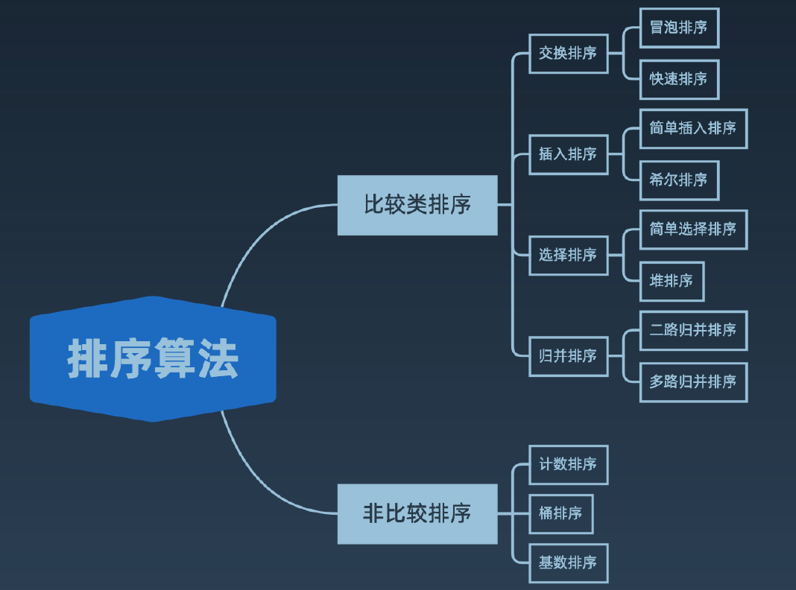

## 位运算、布隆过滤、LRU缓存、排序算法

位运算就是那几个操作，熟记并通过题目练习即可，没啥可说的。

最经典的是十大排序算法：

超哥的这个图很棒，直接将那么多排序算法分成了两大类：比较类排序和非比较类排序。



最重要的是四个排序：快排、选择排序、插入排序、归并排序。

* 冒泡排序：冒泡排序两轮循环，每循环一次将最大的（也可以是最小的，如果逆序的话）放到最后。

  ````python
  def bubble_sort(arr, n):
      for i in range(n):
          for j in range(n-1-i):
              if arr[j] > arr[j+1]:
                  arr[j], arr[j+1] = arr[j+1], arr[j]
                  # 其中有很多可以优化的点，后续补上。
      return arr
  ````

  

* 快速排序：快速排序是取一个pivot(基准位置)，每一次循环（或递归）基准位置的左边小于基准位置的值，右边大于基准位置的值。(待补充)

  ````
  
  ````

  

* 选择排序

* 插入排序

* 归并排序：归并排序的思想和快排有点类似，不过归并是通过不断分裂，直到分裂成的两两小段是有序的，然后不断两两合并两个有序的序列，最终形成一个排序好的序列。

  

##### 下面的练习题目做了一部分，没做的标记下，后续补上。

简单

- [位 1 的个数](https://leetcode-cn.com/problems/number-of-1-bits/)（Facebook、苹果在半年内面试中考过）
- [2 的幂](https://leetcode-cn.com/problems/power-of-two/)（谷歌、亚马逊、苹果在半年内面试中考过）
- [颠倒二进制位](https://leetcode-cn.com/problems/reverse-bits/)（苹果在半年内面试中考过）
- 用自己熟悉的编程语言，手写各种初级排序代码，提交到学习总结中。
- [数组的相对排序](https://leetcode-cn.com/problems/relative-sort-array/)（谷歌在半年内面试中考过）
- [有效的字母异位词](https://leetcode-cn.com/problems/valid-anagram/)（Facebook、亚马逊、谷歌在半年内面试中考过）

中等

- [LRU 缓存机制](https://leetcode-cn.com/problems/lru-cache/#/)（亚马逊、字节跳动、Facebook、微软在半年内面试中常考）
- [力扣排行榜](https://leetcode-cn.com/problems/design-a-leaderboard/)（Bloomberg 在半年内面试中考过）
- [合并区间](https://leetcode-cn.com/problems/merge-intervals/)（Facebook、字节跳动、亚马逊在半年内面试中常考）

困难

- [N 皇后](https://leetcode-cn.com/problems/n-queens/description/)（字节跳动、亚马逊、百度在半年内面试中考过）
- [N 皇后 II ](https://leetcode-cn.com/problems/n-queens-ii/description/)（亚马逊在半年内面试中考过）
- [翻转对](https://leetcode-cn.com/problems/reverse-pairs/)（字节跳动在半年内面试中考过）


### Reference

- [Understanding the Meltdown exploit](https://www.sqlpassion.at/archive/2018/01/06/understanding-the-meltdown-exploit-in-my-own-simple-words/)
- [替换算法总揽](https://en.wikipedia.org/wiki/Cache_replacement_policies)
- [LRU Cache Python 代码示例](https://shimo.im/docs/CoyPAyXooGcDuLQo)

- [十大经典排序算法](https://www.cnblogs.com/onepixel/p/7674659.html)
- [9 种经典排序算法可视化动画](https://www.bilibili.com/video/av25136272)
- [6 分钟看完 15 种排序算法动画展示](https://www.bilibili.com/video/av63851336)
- [如何从十进制转换为二进制](https://zh.wikihow.com/从十进制转换为二进制)

